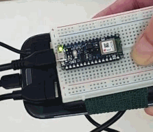

- Android Studio

[*[ Overview ]*](GolfSwingSensors.md/#golf-swing-sensors)
[*[ 1 The Accelerometer ]*](implementation.md/#the-accelerometer)
[*[ 2 Solve for Power ]*](implementation.md/#solve-for-power)
[*[ 3 Enabling BLE ]*](#step-three)
**[*[ Step Four: Enable Smartphone Response ]*](#step-four)**
[*[ Step 4.5: Enable KWS ]*](KWS.md/#key-word-spotting)
[*[ Steps 5 & 6 ]*](activity.md/#steps-five-and-six)
[*[ Reference, etc. ]*](activity.md/#reference)
[_[ jump to new project ideas-> ]_](thoughtsandnotes.md/#other-projects)

##
##### Step Three:
# Enabling BLE

**Description:**

Before we can get it to chirp in response to a good or bad swing, the smartphone needs to pair up with the Arduino BLE Sense. We should be able to see on my Android whatever information we've already sent to the serial monitor. To do this, Nordic has an app we can download from Google Play called _nRF Connect_. Let's go through the process of getting that started right here. 

### Try the BLE example sketch

I found [_**this video**_](https://youtu.be/2q_tA8v5l1Y) from _Robocraze_ to be helpful, 
and copied the code from its [**accompanying GitHub repository**](https://github.com/Robocraze/Nano-33-BLE-Examples/blob/43fbe5b3155493d3056e85d7402c54e05c84f133/environment_sensor_ble/environment_sensor_ble.ino).
This example reads information from the sensors and then simply displays it in the phone app. 
Upload the sketch to the device... _**And it works exactly as it does in that video.**_ 
_But there is a [**caveat**](#caveat) which I discovered for this example._ 

**To do this:**

1. Download _nRF Connect_ from **Google Play** (also available for iOS)
2. Find the `environment_sensor_ble.ino` file from the _Robocraze_ repository and copy it locally. 
_(Right-click on _Raw_, save the file, and drop into same-name folder, as required by Arduino.)_
3. Upload the _environment_sensor_ble_ sketch to the device
4. Open the serial monitor, watch for "Disconnected from central..."
5. (App) Open the phone app, _nRF Connect_, and enable Bluetooth
6. (App) Scan for and connect to the device (its name was declared in the sketch)
7. (App) Touch _UnknownService, UUID: 0x180C_ (_"180C"_ is unregistered generic UUID)
8. Watch Monitor again for services to pop up
9. (App) Touch the "triple down arrow"  for each of the three services for this example
10. (App) OBSERVE the temperature gradually reach ambient room temperature or hold in hand for it to rise

##### Caveat:

With the USB cable plugged into the computer I **_can_** discover _"Arduino Environment Sensor"_ in nRF Connect. 
But a [**battery-only**](implementation.md/#current-development-solution) solution can **_not_**. So...

**For battery-only:**

- Comment out `//while (!Serial);` 

After being untethered from the computer, the device was trying to find the serial port from which it's now disconnected.
So this one change will allow the device to function in _nRF Connect_ the same way as it did before.

### The Hello World BLE Sketch

Now that we've got the BLE connecting, and IMU data showing up in _nRF Connect_, it's time to simplify and specialize our code.

There is a _BLE Hello World_ sketch from [okdo.com](activity.md/#reference) 
that turns on the amber LED on the Arduino board when it connects, 
and we can then read "Hello World" on the Client (smartphone) app.
So starting with this simple code as a base, **we'll combine it with our own _golf-swing-acc_ sketch** 
so that we can see what gets sent from the Nano33BLESense.

- View the _Hello World BLE code_ [**here**](#ble-hello-world-code-is-here)

The big takeaway with this code is that the `while (central.connected())` command just hangs the activity until BLE disconnects and then the code turns the LED off. 
(It's LED-centric code.) 
The LED will be useful for indicating "Ready" and "Resting" states.

We've seen in those two examples what a basic `.ino` file looks like. **Here's a summary:**

### Arduino File Structure

Here we will describe the very basic structure of an Arduino `.ino` file. 

**At the most basic level, there are four sections:**

1. *"prior to"*
2. `void setup()`
3. `void loop()` and
4. *"other functions"*

**1. prior to `void setup()`**

- These can be within _namespace_
- First add LIBRARIES
- Initialize and name CONSTANTS
- Initialize VARIABLES
- Initialize BLE SERVICES
  - Give the Services and Characteristics their UUIDs ([here](activity.md/#uuid-info) for more info)
- Initialize respective BLE Service CHARACTERISTICS
- Create the FUNCTION PROTOTYPE (which reside in "other functions" area)

**2. `void setup()`**

- Initialize the SENSORS
- Initialize SERIAL COMMUNICATION
- Initialize OTHER things (such as built-in LED pin)
- Check for FAILURE
- Create the BLE NAME to show up in the SCAN
- Create the BLE SERVICE for advertising
- Create the BLE Service CHARACTERISTICS
- ADD the BLE SERVICE to advertise
  - The variable names were previously initialized above
- ADVERTISE BLE
- Set VALUES for strings or constants
  - These variables were previously initialized above
  
**3. `void loop()`**

- conditional settings and calculations repeated within the loop
- _if-else_ statements, etc
- engaging LEDs, etc

**4. other functions**

- subroutines _(and other stuff)_

### Creating the new code

**Importing new functionality into our code:**

We're now going to take what we've learned from our two examples and incorporate them into our feature code, now called **_golf-swing-acc-ble_**.

- View the combined code [**here**](#all-the-golf-swing-acc-ble-code-is-here)

##### Phone screen with device listed: (1) scanning, (2) connected, (3) tilting on the y-axis to turn on/off the LED

<p align="center">
  (1) 
  (2) 
  (3) 
</p>

##

**Almost done**

Although things are working well, there are still two things we should improve upon. 
One tweak is to accommodate for an unintentional state change from a bounce of the sensor, 
and the other is to reduce the amount of BLE communication, sending only once at the moment of a state change.

Created **_golf-swing-acc-ble-statechange_** with this modified code: 
- Eliminate accidental state changes from the sensor
- Send data via BLE **only** when the state changes 
- Send _boolean 1/0_ rather than the strings, "Resting" and "Ready"
- Use the shorter 16-bit UUID, like `ffe0` and `ffe1` [_(More about UUID)_](activity.md#uuid-info)

##### BLE sends data only when the words "State change to" appear


## Summary:

**Server/peripheral-side programming is done.**

We started with physically setting up the Arduino Nano33BLESense as if it were attached to the back of a golf club head.
Then we implemented the code to be able to see the readings of the Accelerometer in the Serial Monitor screen.
After experimenting with a couple of example sketches, we incorporated the BLE library into the code, downloaded the nRF Connect application to a smartphone, and were **able to see readings** coming from the Nano33BLESense.

The Nano33BLESense has been programmed to communicate with a Client (central), so it's now time to develop an Android application that it can control, basically with an on/off signal sent through Bluetooth Low Energy.

We're starting from scratch with Android Studio. Let's move on to...
**Step Four: App Development, aka [_Enable Smartphone Response_](#step-four)**
_... which is entirely new to me at this point._

**Pages:**

[*[ top ]*](GolfSwingSensors.md/#golf-swing-sensors)
[*[ 1 ]*](implementation.md/#the-accelerometer)
[*[ 2 ]*](implementation.md/#solve-for-power)
[*[ 3 ]*](#step-three)
**[Next: _[ 4 ]_](#step-four)**
[*[ Reference ]*](activity.md/#reference)
[*[ KWS ]*](KWS.md/#key-word-spotting)
[*[ 5 & 6 ]*](activity.md/#steps-five-and-six)
[_[ notes ]_](thoughtsandnotes.md/#other-projects)


##
### Code:

##
##### _BLE Hello World_ code is here:
[(back)](#the-hello-world-ble-sketch)

```
/*
  Arduino Nano 33 BLE Getting Started
  BLE peripheral with a simple Hello World greeting service that can be viewed
  on a mobile phone
  Adapted from Arduino BatteryMonitor example
*/

#include <ArduinoBLE.h>

static const char* greeting = "Hello World!";

BLEService greetingService("180C");  // User defined service

BLEStringCharacteristic greetingCharacteristic("2A56",  // standard 16-bit characteristic UUID
    BLERead, 13); // remote clients will only be able to read this

void setup() {
  Serial.begin(9600);    // initialize serial communication
  while (!Serial);

  pinMode(LED_BUILTIN, OUTPUT); // initialize the built-in LED pin

  if (!BLE.begin()) {   // initialize BLE
    Serial.println("starting BLE failed!");
    while (1);
  }

  BLE.setLocalName("Nano33BLE");  // Set name for connection
  BLE.setAdvertisedService(greetingService); // Advertise service
  greetingService.addCharacteristic(greetingCharacteristic); // Add characteristic to service
  BLE.addService(greetingService); // Add service
  greetingCharacteristic.setValue(greeting); // Set greeting string

  BLE.advertise();  // Start advertising
  Serial.print("Peripheral device MAC: ");
  Serial.println(BLE.address());
  Serial.println("Waiting for connections...");
}

void loop() {
  BLEDevice central = BLE.central();  // Wait for a BLE central to connect

  // if a central is connected to the peripheral:
  if (central) {
    Serial.print("Connected to central MAC: ");
    // print the central's BT address:
    Serial.println(central.address());
    // turn on the LED to indicate the connection:
    digitalWrite(LED_BUILTIN, HIGH);

    while (central.connected()){} // keep looping while connected
    
    // when the central disconnects, turn off the LED:
    digitalWrite(LED_BUILTIN, LOW);
    Serial.print("Disconnected from central MAC: ");
    Serial.println(central.address());
  }
}
```

##
##### All the _golf-swing-acc-ble_ code is here:
[(back)](#creating-the-new-code)

```
/*
 * Arduino LSM9DS1 
 * - Simple Accelerometer
 * golf-swing-acc
 * golf-swing-acc-ble
 */
 
// LIBRARIES
#include <ArduinoBLE.h>         // BLE library
#include <Arduino_LSM9DS1.h>    // IMU library

// CONSTANTS
static const char* imuUUID = "355d2b52-982c-4598-b9b4-c19156686e1a";
static const char* accUUID = "9e5982a7-9ef0-48e0-a167-8112ada5f184";
static const char* stateUUID = "9dc52af2-d585-4fb7-93a7-922b463239fe";

// INITIALIZE VARIABLES
/*
 * (example) String p, t, m; // Initalizing global variables for...
 */

// BLE SERVICE NAME (create service)
BLEService IMUService(imuUUID);

// BLE CHARACTERISTICS (create characteristics)
BLEFloatCharacteristic ble_accelerometer(accUUID, BLERead | BLENotify); // for the IMU service
BLEStringCharacteristic ble_state(stateUUID, BLERead | BLENotify, 10); // for the IMU service

// FUNCTION PROTOTYPE
/*
 * set up more functions here
 */

void setup() {
  // INITIALIZE THE SENSORS (and serial)
  IMU.begin();          // initialize IMU
  Serial.begin(9600);   // initialize serial comms
  //while (!Serial);    // comment this out

  // INITIALIZE THE DEVICE PINS
  pinMode(LED_BUILTIN, OUTPUT); // initialize the built-in LED pin
  
  // CHECK FOR FAILURE
  // BLE check
  if (!BLE.begin()) {
    Serial.println("starting BLE failed!");
    while (1); 
  }
  // IMU check
  if (!IMU.begin()) {
    Serial.println("Failed to initialize IMU!");
    while (1); 
  }
  
  // SET BLE NAME (create device name)
  BLE.setLocalName("Nano33BLESense");
  
  // ADVERTISE SERVICES
  BLE.setAdvertisedService(IMUService);
  
  // ADD CHARACTERISTICS TO BLE SERVICES
  IMUService.addCharacteristic(ble_accelerometer);
  IMUService.addCharacteristic(ble_state);
  
  // ADD SERVICES TO BLE STACK (add service to advertise)
  BLE.addService(IMUService);    // Add IMU Service
  
  // SET VALUES FOR STRINGS
  /*
   * setValue(x) stuff here
   */
  
  // START ADVERTISING (advertise all services)
  BLE.advertise();
  
} //s

void loop() {
  // Wait for a BLE central to connect
  BLEDevice central = BLE.central();

  // IMU activity
  float x, y, z;

  if (IMU.accelerationAvailable()) {
    IMU.readAcceleration(x, y, z);

    ble_accelerometer.writeValue(y);    // sends hex value

    // threshold is -1G
    if ( y > -.85 ) {
      
      // print to BLE
      ble_state.writeValue("Ready!");
      
      // engage the LED
      digitalWrite(LED_BUILTIN, HIGH);
      
      // print to Serial port
      Serial.print("Ready!");
      Serial.print('\t');
      Serial.print("X = ");
      Serial.print(x);
      Serial.print('\t');
      Serial.print("Y = ");
      Serial.print(y);
      Serial.print('\t');
      Serial.print("Z = ");
      Serial.println(z);
      }
    
    else { 
      
      // print to BLE
      ble_state.writeValue("Resting!");
      
      // engage the LED
      digitalWrite(LED_BUILTIN, LOW);
      
      // print to Serial port
      Serial.print("One second delay...");
      Serial.print('\t');
      Serial.print("Y = ");
      Serial.println(y);
      delay(1000); // one second delay
      }
    }
  } //v
```
_(end)_

##

#

#

##

(move to its own page _AppDev.md_)

#

[*[ top ]*](GolfSwingSensors.md/#golf-swing-sensors)
[*[ 1 ]*](implementation.md/#the-accelerometer)
[*[ 2 ]*](implementation.md/#solve-for-power)
[*[ 3 ]*](#step-three)
**[Next: _[ 4 ]_](#step-four)**
[*[ Reference ]*](activity.md/#reference)
[*[ KWS ]*](KWS.md/#key-word-spotting)
[*[ 5 & 6 ]*](activity.md/#steps-five-and-six)
[_[ notes ]_](thoughtsandnotes.md/#other-projects)

##
##### Step Four:
# Enable Smartphone Response

**Description:**

**<-- edit below here -->**

- utilize virtual environment

#

**Now that state changes can be sent to the smartphone, try to turn its flashlight on/off with the signal!**
What we want to do for this project is to read information from the sensor and then get the phone app to act upon the capabilities of the phone, such as turning on a flashight or beeping. 
While the flashlight functionality won't be used in the end, that solution is crucial for when we're trying to get the phone to chirp good/bad golf swings. 

#

Now that data is being transmitted from the Nano33BLESense, we need to develop an Android application that receives it. (Android Studio)

#

We want to develop an Android app that will turn on and off its flashlight or beep high and low, depending on the Resting state.

#

##### App Development
- Lookup: How to control Android with... (controller, another android, etc) and find some development apps?
- Here is **Android BLE [guide](https://punchthrough.com/android-ble-guide/)**
- What can be configured in my phone when it receives commands from the nRF Connect (or other) application?
  - Can the phone app trigger **BEEP** or a vibration/buzz?
  - Can the App turn on/off the phone's **flashlight**?
- Enable smartphone functions with _nrfconnect_ or Android Studio (Requires SDK and toolchain)
- Make high and low pitches for "Ready" state on/off (as the example) and apply this same code later. 
- _Beep triggered by in/out of Ready state is not for final product, but good for this development, because there is other activity that will require prompting smartphone to act on something in some way._

#

#### the key:
**Link to [KABLE](https://github.com/JuulLabs/kable)**
- "Kotlin Asynchronous Bluetooth Low Energy provides a simple Coroutines-powered API for interacting with Bluetooth Low Energy devices."

#

Flashlight:
- When the state goes from 0 to 1, I want the phone's flashlight to turn on. When it goes from 1 to 0, should turn off.
- More directly, state change into and out of Ready/Resting states. If `y < -.85` then turn on the flashlight on my phone!

#

Now:
- _Most likely, need to just figure out what to do with an Android app, and **act upon the UUID changing from 0 to 1**_

This is the research I am doing now.
- nRF Connect to respond by making my phone beep or flashlight on and off (or more likely, using Android Studio instead)

##
##

(end)

