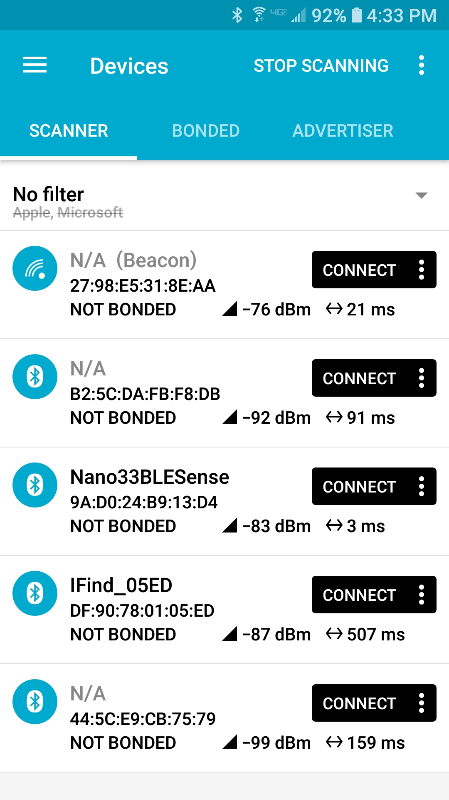
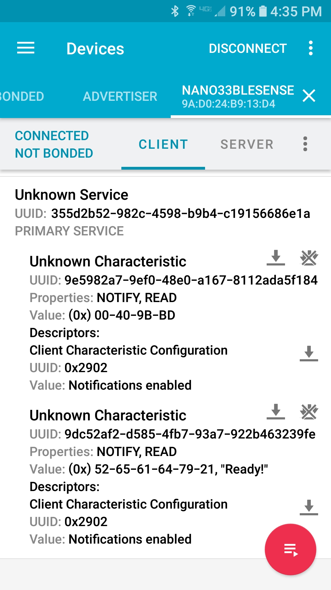
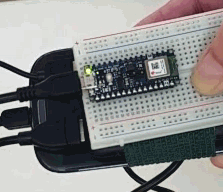

[*[ Overview ]*](README.md/#golf-swing-sensors)
[*[ 1 The Accelerometer ]*](implementation.md/#the-accelerometer)
[*[ 2 Solve for Power ]*](implementation.md/#solve-for-power)
[*[ **Step Three: Enable BLE+IMU** ]*](#step-three)
[*[ Step Four: Enable Smartphone to BEEP ]*](#step-four)
[_[ jump to new project ideas-> ]_](thoughtsandnotes.md/#other-projects)

#
##### Step Three:
# Enabling BLE

#### Description
Before we can get it to chirp in response to a good or bad swing, the smartphone needs to pair up with the Arduino BLE Sense. We should be able to see on my Android whatever information we've already sent to the serial monitor. To do this, Nordic has an app we can download from Google Play called _nRF Connect_. Let's go through the process of getting that started right here. 

### Try the BLE example sketch
I found -[_**this video**_](https://youtu.be/2q_tA8v5l1Y)- from _Robocraze_ to be helpful, 
and copied the code from its [**accompanying GitHub repository**](https://github.com/Robocraze/Nano-33-BLE-Examples/blob/43fbe5b3155493d3056e85d7402c54e05c84f133/environment_sensor_ble/environment_sensor_ble.ino).
This example reads information from the sensors and then simply displays it in the phone app. 
Upload the sketch to the device... _**And it works exactly as it does in that video.**_ 
_But there is a [**caveat**](#caveat) which I discovered for this example._ 
We'll refer to this _RoboCraze_ code for reference in the future if we need to.

#### To do this:
1. Download _nRF Connect_ from **Google Play** (also available for iOS)
2. Find the `environment_sensor_ble.ino` file from the _Robocraze_ repository and copy it locally. 
_(Right-click on _Raw_, save the file, and drop into same-name folder, as required by Arduino.)_
3. Upload the _environment_sensor_ble_ sketch to the device
4. Open the serial monitor, watch for "Disconnected from central..."
5. (App) Open the phone app, _nRF Connect_, and enable Bluetooth
6. (App) Scan for and connect to the device (its name was declared in the sketch)
7. (App) Touch _UnknownService, UUID: 0x180C_ (_"180C"_ is unregistered generic UUID)
8. Watch Monitor again for services to pop up
9. (App) Touch the "triple down arrow"  for each of the three services for this example
10. (App) OBSERVE the temperature gradually reach ambient room temperature or hold in hand for it to rise

##### Caveat:
With the USB cable plugged into the computer I **_can_** discover _"Arduino Environment Sensor"_ in nRF Connect. 
But a [**battery-only**](implementation.md/#current-development-solution) solution can **_not_**. So...

#### For battery-only:

- **Comment out `//while (!Serial);`** 

After being untethered from the computer, the device was trying to find the serial port from which it's now disconnected.
So this one change will allow the device to function in nRF Connect the same way as it did before.

#
### The Hello World BLE Sketch

Now that we've got the BLE connecting, and IMU data showing up in nRF Connect, it's time to simplify and specialize our code.

There is a simple _BLE Hello World_ sketch from [okdo.com](#reference) that turns on the amber LED on the Arduino board when it connects. And after connecting with nRF Connect, we can read "Hello World" on our smartphone.

What's interesting to me (newbie!) is using `static const char* greeting = "Hello World!";` first, and then later using `greetingCharacteristic.setValue(greeting);` for that string to appear through the characteristic.

#

Starting with this simple code as a base, **we'll combine it with our own _golf-swing-acc_ sketch** 
so that we can see what gets sent to _nRF Connect_ from the BLESense.

##### _BLE Hello World_ code is here:
```
/*
  Arduino Nano 33 BLE Getting Started
  BLE peripheral with a simple Hello World greeting service that can be viewed
  on a mobile phone
  Adapted from Arduino BatteryMonitor example
*/

#include <ArduinoBLE.h>

static const char* greeting = "Hello World!";

BLEService greetingService("180C");  // User defined service

BLEStringCharacteristic greetingCharacteristic("2A56",  // standard 16-bit characteristic UUID
    BLERead, 13); // remote clients will only be able to read this

void setup() {
  Serial.begin(9600);    // initialize serial communication
  while (!Serial);

  pinMode(LED_BUILTIN, OUTPUT); // initialize the built-in LED pin

  if (!BLE.begin()) {   // initialize BLE
    Serial.println("starting BLE failed!");
    while (1);
  }

  BLE.setLocalName("Nano33BLE");  // Set name for connection
  BLE.setAdvertisedService(greetingService); // Advertise service
  greetingService.addCharacteristic(greetingCharacteristic); // Add characteristic to service
  BLE.addService(greetingService); // Add service
  greetingCharacteristic.setValue(greeting); // Set greeting string

  BLE.advertise();  // Start advertising
  Serial.print("Peripheral device MAC: ");
  Serial.println(BLE.address());
  Serial.println("Waiting for connections...");
}

void loop() {
  BLEDevice central = BLE.central();  // Wait for a BLE central to connect

  // if a central is connected to the peripheral:
  if (central) {
    Serial.print("Connected to central MAC: ");
    // print the central's BT address:
    Serial.println(central.address());
    // turn on the LED to indicate the connection:
    digitalWrite(LED_BUILTIN, HIGH);

    while (central.connected()){} // keep looping while connected
    
    // when the central disconnects, turn off the LED:
    digitalWrite(LED_BUILTIN, LOW);
    Serial.print("Disconnected from central MAC: ");
    Serial.println(central.address());
  }
}
```

#### How we will use this:

The big takeaway with this code is that the `while (central.connected()){` command just hangs the activity until BLE disconnects and then the code turns the LED off. 
**_It's LED-centric code._** 
The code for the LED will be useful for indicating "Ready" and "Resting" states.

**These two examples have shown us what a basic `.ino` file looks like.**

#
## Arduino File Structure

Here we will describe the very basic structure of an Arduino `.ino` file. 

#### At the most basic level, there are four sections:

1. *"prior to"*
2. `void setup()`
3. `void loop()` and
4. *"other functions"*

#
#### 1. **Prior to `void setup()`**

- These can be within _namespace_
- First add LIBRARIES
- Set CONSTANTS
- Initialize VARIABLES
- Add SERVICES
  - Give the Services and Characteristics their UUIDs ([here](#uuid-info) for more info)
- Add respective Service CHARACTERISTICS
- Create the FUNCTION PROTOTYPE (which reside in "other functions" area)

#### 2. `void setup()`

- INITIALIZE THE SENSORS
- Initialize SERIAL COMMUNICATION
- And initialize OTHER things (such as built-in LED pin)
- Check for FAILURE
- Set the NAME to show up in the SCAN
- Set BLE SERVICE ADVERTISEMENT
- ADD CHARACTERISTICS to the BLE services
- ADD SERVICE to the BLE stack
  - The variable names were previously declared in "Add Services" section prior to the setup loop
- Set VALUES for strings
  - This variable was set previously, in the "Constants" section prior to the setup loop
- ADVERTISE
  
#### 3. `void loop()`

- settings and calculations within the repeated loop (edit this)
- _if-else_ statements

#### 4. **other functions**

- subroutines and stuff (edit this)


#
## Creating the new code
##### Importing new functionality into our code

We're now going to take what we've learned from our two examples and incorporate them into our feature code, now called **_golf-swing-acc-ble_**.

##### All the _golf-swing-acc-ble_ code is here:
```
/*
 * Arduino LSM9DS1 
 * - Simple Accelerometer
 * golf-swing-acc
 * golf-swing-acc-ble
 */
 
// LIBRARIES
#include <ArduinoBLE.h>         // BLE library
#include <Arduino_LSM9DS1.h>    // IMU library

// CONSTANTS
static const char* imuUUID = "355d2b52-982c-4598-b9b4-c19156686e1a";
static const char* accUUID = "9e5982a7-9ef0-48e0-a167-8112ada5f184";
static const char* stateUUID = "9dc52af2-d585-4fb7-93a7-922b463239fe";

// INITIALIZE VARIABLES
/*
 * (example) String p, t, m; // Initalizing global variables for...
 */

// BLE SERVICE NAME (create service)
BLEService IMUService(imuUUID);

// BLE CHARACTERISTICS (create characteristics)
BLEFloatCharacteristic ble_accelerometer(accUUID, BLERead | BLENotify); // for the IMU service
BLEStringCharacteristic ble_state(stateUUID, BLERead | BLENotify, 10); // for the IMU service

// FUNCTION PROTOTYPE
/*
 * set up more functions here
 */

void setup() {
  // INITIALIZE THE SENSORS (and serial)
  IMU.begin();          // initialize IMU
  Serial.begin(9600);   // initialize serial comms
  //while (!Serial);    // comment this out

  // INITIALIZE THE DEVICE PINS
  pinMode(LED_BUILTIN, OUTPUT); // initialize the built-in LED pin
  
  // CHECK FOR FAILURE
  // BLE check
  if (!BLE.begin()) {
    Serial.println("starting BLE failed!");
    while (1); 
  }
  // IMU check
  if (!IMU.begin()) {
    Serial.println("Failed to initialize IMU!");
    while (1); 
  }
  
  // SET BLE NAME (create device name)
  BLE.setLocalName("Nano33BLESense");
  
  // ADVERTISE SERVICES
  BLE.setAdvertisedService(IMUService);
  
  // ADD CHARACTERISTICS TO BLE SERVICES
  IMUService.addCharacteristic(ble_accelerometer);
  IMUService.addCharacteristic(ble_state);
  
  // ADD SERVICES TO BLE STACK (add service to advertise)
  BLE.addService(IMUService);    // Add IMU Service
  
  // SET VALUES FOR STRINGS
  /*
   * setValue(x) stuff here
   */
  
  // START ADVERTISING (advertise all services)
  BLE.advertise();
  
} //s

void loop() {
  // Wait for a BLE central to connect
  BLEDevice central = BLE.central();

  // IMU activity
  float x, y, z;

  if (IMU.accelerationAvailable()) {
    IMU.readAcceleration(x, y, z);

    ble_accelerometer.writeValue(y);    // sends hex value

    // threshold is -1G
    if ( y > -.85 ) {
      
      // print to BLE
      ble_state.writeValue("Ready!");
      
      // engage the LED
      digitalWrite(LED_BUILTIN, HIGH);
      
      // print to Serial port
      Serial.print("Ready!");
      Serial.print('\t');
      Serial.print("X = ");
      Serial.print(x);
      Serial.print('\t');
      Serial.print("Y = ");
      Serial.print(y);
      Serial.print('\t');
      Serial.print("Z = ");
      Serial.println(z);
      }
    
    else { 
      
      // print to BLE
      ble_state.writeValue("Resting!");
      
      // engage the LED
      digitalWrite(LED_BUILTIN, LOW);
      
      // print to Serial port
      Serial.print("One second delay...");
      Serial.print('\t');
      Serial.print("Y = ");
      Serial.println(y);
      delay(1000); // one second delay
      }
    }
  } //v
```
**We have created code that shows Ready/Resting on the serial monitor and on the nRF Connect app, but also, we got the LED on the device to light up as well!**

#

##### Phone screen with device listed: (1)Scanning, (2)Connected 
(1) (2)

##### Turning on and off the LED by tilting on the y-axis
  
  
#
## Summary so far:

In this section we transformed the _golf-swing-acc_ code to include BLE communication. We took two example sketches to learn about the Arduino file structure and imported the code we needed into **_golf-swing-acc-ble_** to enable it to communicate with a smartphone running the _nRF Connect_ app.
#

Next:
- [**_[ Continuing with BLE --> ]_**](EnablingBLE.md)
- [**_[ UUID Info ]_**](uuid-info)
- [**_[ Reference ]_**](#reference)
- [**_[ Enabling the gyro ]_**](#steps-five-and-six)
- [**_[ Recording the data ]_**](#steps-five-and-six)
- [**_[ KWS (Key Word Spotting) ]_**](#key-word-spotting)

#

## UUID Info:
#### Notes about UUID

- [Online UUID Generator](https://www.uuidgenerator.net/) created the [unique UUIDs](#15-unique-v4uuids)
- _Keep studying about UUID_
- Need to have specific UUIDs for each IMU param
- I can't find a specific standard UUID for x,y,z on the Accelerometer
  - check _GATT Angulars_ note, [**here**](#gatt-angulars) 
  - what does the **raw** IMU data look like? (move this)
- check the hackster.io post in the [Reference](#reference)
  - Here: the [hackster](https://www.hackster.io/gov/imu-to-you-ae53e1) site again
- I thought I would need to use the BLE UUID spec which I thought was "important for ble"
  - UUID for BLE: _XXXXXXXX-0000-1000-8000-00805F9B34FB_ (Look this up to find standard BLE list)
- Go simpler. Look how they use them in the examples, and use theirs instead. Also, make them up: "FFF1" etc.
- Changed to 16-bit in the code.

#### (15 unique v4UUIDs)
```
355d2b52-982c-4598-b9b4-c19156686e1a    // for imuUUID (ffe0)
9e5982a7-9ef0-48e0-a167-8112ada5f184    // for accUUID (ffe1)
9dc52af2-d585-4fb7-93a7-922b463239fe    // for stateUUID (ffe2)
8564aabe-417c-4fe4-8a40-543ea08079f4    
3e8c97c5-6ae5-444f-b56e-20a741e7bf99
f2024cef-dae8-4db7-bddb-76c696cdc115
62237f9d-7652-442a-a36a-0a68d96bd617
f22e0e5c-9636-4a83-9eaa-ba309101c4b6
88abdb86-22fb-4b2f-8d35-53bb942625b7
0a374697-2847-4d15-b7b2-b89281022f65
b60136d1-e8c5-4042-82e8-a0f6fcd4f6d4
989ae3c5-6e5a-4868-96c7-011511e880b2
d49b4462-2bfd-4d92-8103-88ed9429e662
52f6c067-db43-4e53-893b-d7d98406901b
fa94204d-dc71-4585-aa63-98b8133c5266
```

#

# Reference:

- Here's the okdo.com example, including [_BLE Hello World_](#the-ble-hello-world-sketch): [**getting started** from *okdo.com*](https://www.okdo.com/getting-started/get-started-with-arduino-nano-33-ble/#h-1-configure-ide-toc) (keep this info in reference section)
- Helpful from Argenox:
  - [**Argenox website**](https://www.argenox.com/library/bluetooth-low-energy/ble-advertising-primer/) is a good place to READ about BLE
  - Here's the [Bluetooth Low Energy Library](https://www.argenox.com/library/bluetooth-low-energy/)
  - Here is a link for [BLE and batteries](https://www.argenox.com/library/bluetooth-low-energy/powering-ble-batt/)
- **Arduino** resources:
  - Arduino's reference for BLE](#arduinos-reference-for-ble) _(double check this link)_
  - Go through all the _ArduinoBLE_ sketches **in the Examples folder in the IDE**
  - Also use the [**Arduino guide for NANO33BLESense**](https://www.arduino.cc/en/Guide/NANO33BLESense) for reference
  - A complete [reference](https://www.arduino.cc/reference/en/)
  - And one specifically for [BLE](https://www.arduino.cc/reference/en/libraries/arduinoble/)
- Here's some GATT information [(_LINK_)](https://www.oreilly.com/library/view/getting-started-with/9781491900550/ch04.html) from O'Reilly (2014), and its repository, [(_here._)](https://github.com/microbuilder/IntroToBLE)
- **Nordic Semi** resources:
  - Helpful [**beginners tutorial**](https://devzone.nordicsemi.com/nordic/short-range-guides/b/bluetooth-low-energy/posts/ble-advertising-a-beginners-tutorial) from Nordic Semi. 
  - And another [**here.**](https://devzone.nordicsemi.com/nordic/short-range-guides/b/bluetooth-low-energy/posts/bluetooth-smart-and-the-nordics-softdevices-part-1)
- **nRF Connect:**
  - nRF Connect is good for testing and connecting. I don't know yet how it dovetails into specific app development, but using nRF Connect seems to be the right phone app to use for this.
  - In my case, I would set up my Arduino as the server, and the nRF Connect as the client. Because the server/sensor sends out information and the client receives it.
- **Hackster** tutorial: Here's a helpful [IMU and BLE](https://www.hackster.io/gov/imu-to-you-ae53e1) tutorial from hackster.io
- Wiki about [C data types](https://en.wikipedia.org/wiki/C_data_types#stdint.h)

#

##### Digging deeper into the _magic wand_
### magic wand
- **LEARN** 
[from the course](https://learning.edx.org/course/course-v1:HarvardX+TinyML3+1T2021/block-v1:HarvardX+TinyML3+1T2021+type@sequential+block@e355a78c0dcd49b6acbeeaf8f7492859/block-v1:HarvardX+TinyML3+1T2021+type@vertical+block@6e2f8e18dd814e63ad68f60e380b6633)
about the _magic-wand_ sketch to see how the DATA is recorded there and what gets transmitted to the Serial Monitor, and then how that data displays on the Monitor from that data. What converts that data to the 'readable' visualization of the motion?
[**This** is the link to the course data collection browser app (use Chrome)](https://tinyml.seas.harvard.edu/magic_wand/).
- **TEST the motion of the gyro/acc.** Can this motion show up on the Plotter or Monitor? What does this motion look like for gyro/acc individually? Is it helpful to sample the data more slowly for better visualization?
- HOW does this data get recorded into a data point? We recorded a data set for the Exercise. So _how was that collected?_
- **_Can this activity happen LOCALLY?_** Because the exercise actually resided on _tinymlx.io_ or something. And that's where all the data got generated.
- **How much reliance upon external websites is necessary? Why not ALL local?**

#

#

#

#

# Possibly useful ideas go here

- [(link to notify/indicate)](EnablingBLE.md#notifyindicate)
- [(link to **Magic wand**)](#magic-wand)

#

##### GATT angulars
**Interesting:** There are two GATT units, 0x2743 and 0x2744, which are _angular velocity (radian per second)_ and _angular acceleration (radian per second squared)_, respectively. Don't know whether I'd be able to use this. It's related to centripetal force.

#

##### Note about HEX
We were able to pass text into the app, such as "Ready" and "Resting".
"Ready" and "Resting" could be read as a string, and could read each letter hex value. 
Both strings began with the same hex values for "R" and "e".

#

##### Helpful Info:
- The all-inclusive Arduino file will be saved as _golf-sensors.ino_ when more sensors are involved.
  - Multiple "h" file can probably be included, to split off logically (see: [_magic wand_](#digging-deeper-into-the-magic-wand) example) from the _.ino_ file.
- For images, this is helpful: resizing and centering with `<p align="center"></p>`
- Create an _interval_ for some sensor readings, using `millis()` not `delay()`. But `delay()` is good during Resting state, because all sensors are meant to be off.
- Change LED from one state to the other: `digitalWrite(LED_BUILTIN, !digitalRead(LED_BUILTIN));`

#

#### Key Word Spotting
- Need to bump up the application for key word spotting. (break this section out independently)
- Enable the microphone on the Arduino to do this.
- Start using **TensorFlow Micro**.
- Which step is this going to be? Before enabling gyro? Collect gyro data first?
- Can this be applied after app development stage? After I get the phone to beep when the sensor reaches threshold, can it listen for key word and act on the sensor output to make the smartphone turn on the flashlight? Listen for "on"/"off" or "yes"/"no" and then turn the LED on or off?
- When in Ready state, turn on Gyro, finish Gyro motion, _then listen for key word_.
  - So do gyro step first. But before data collection?
  - Where does KWS fit in the flow?

Steps:
- App Development: make phone beep for Ready/Resting state
- Enable gyro when in Ready state, and start recording information when gyro readings "SETTLE"
- Study how gyro works. What do the readings look like? When I wave around the device, are the readings moving around? Do the readings stop when I stop?
- This ican be done by displaying all the readings on the Serial Monitor.
- Take the current code and start displaying gyro stuff if "acc" y-axis is at a threshold. Threshold for being in Ready state is `y>-.85` but that's just for turning the "system" on and off. The threshold for trying to look for Settled state is going to be different, and it's probably going to be based on being between `y>0.5` and `y>0.75` before it starts considering the gyroscope.
  - So, `if y>0.5` then _listen-for-gyro_ and then _wait-for-gyro-to-settle_ and then _begin-recording-gyro_ until a "gyro" type of threshold, when it stops recording. Maybe it's possible to record data points every 20millis, and stop after a specific number of data points. (yes)
  - And then after recording a few data points, it jumps into keyword spotting, meaning that it enables the microphone and waits to hear the word "yes", at which point makes the LED turn on or makes the phone beep.
  - Can test this by running a KWS test. The only code would be to turn on the microphone on the device, and wait to hear the key word. Like hears "yes" and LED turns on, then off after three seconds. This **test** can be isolated in our code. Go over one of the class lessons.
  - It looks like TinyML model could end up being KWS for this and also Gesture-type Model for gyro data. But now that I describe it like this, it doesn't sound so bad. After all, this is the same thing that happened in the class when image-spotting (face-ID) is ongoing, and when True, it switches over to KWS. **This** is the principle of **multi-tenancy**.

##### Steps:
- Finish App Development (**get the phone to beep**) and _finalize_ it, including video of success and simplifying code.
- Create simple KWS code.
  - **Turn the LED on and off with "yes" or "no".** Use Pete Warden's simple dataset _(refer to the class)_ so that I don't have to create my own, or use EdgeImpulse to create my own "yes"/"no" dataset, or do it myself as I did in the class.

#

#### Dog bark KWS example:
Sensor devices similar to the BLE Sense have been used to trigger audio to play from another device.
The dog barking example from YouTube (here) is one. 
So I need to use the matching code from that example and apply it for my purpose,
which is to get nRF Connect to trigger actions in my phone.
That microphone sensor created KWS model that triggered an app to play some prerecorded audio.
And I want my accelerometer to trigger my phone flashlight on/off, because it senses _Ready/Resting_ states.
- Found [**this**](https://youtu.be/v5hBjouFHQY) dog bark video about how the BLE Sense triggered other devices.
- Question is whether it's using BLE or some other connection. But it's a good example of KWS.
  - Wouldn't need BLE if listening device connects with wire to audio player!

#

**KWS idea.** Enable the microphone after the flashlight starts to function with the IMU.
Use the Warden Dataset to configure KWS to utilize "yes" and "no" to turn off and on the flashlight, using TinyML.

#
#

##### characteristic notes:
Next, add a specific CHARACTERISTIC. If it were a string, there would also be a number for its data length.
- "2A58" seems quite arbitrary and in other examples is actually the 128-bit UUID. Came from the example. _Each characteristic either DOES or DOES NOT need a unique UUID, so I'll have to **look this up** and why._ (I believe that a service has a unique UUID, and it's characteristics are also unique UUIDs.) [**Refer to UUID section.**](#UUID-info)

##### char advert notes:
Anything that's going to be sent to the smartphone via BLE would be added like this, under `customService.addCharacteristic(example_char)` and then accessed within later code and displayed using `example_char.writeValue()`. (true, good note)

##### robocraze example notes
Here is where the `readValues()` is used in the _RoboCraze_ example sketch.
The `readValues()` is not used in this case, but in the _RoboCraze_ example, it combines readings and labels into a string
which can be read easily in nRF Connect with `writeValue(m)`. 
_( `readValues()` is a function; read [here](#structure-of-arduino-files) )_ `readValues()` is a subroutine to collect the x,y,z of the sensor, and combine it into a readable string.
**And the `readValues()` function executes from inside of the `while (central.connected())` loop.** (refer to the actual code from _RoboCraze_ for what's in 'readValues'
- _This is where x,y,z readings are combined and turned into text strings, rather than leaving it as RAW._

#
#### Repository Question
- Are libraries separate from this code? (probably yes) Libraries are listed within the code, so no need to describe more than _"verify you have all the libraries installed"_. 

#

#

#

#

#
##### Transition/conclusion
# BLE conclusion
Move this to "Digging deeper into BLE" section, after enabling the code on the device.
This lies between completing the BLE code and "Getting Started with the SDK".

#### Link to: [Digging into app dev](#digging-into-app-dev)
"Digging into app dev" is a conclusion and intro. Any discussion under this heading would be a transitional narrative. It is brief, but I was intending on saying that we've connected the device to the app, and now it's time to figure out how the app works. In order to do that, we need to dig into the development tools of nRF Connect. **There's a YouTube set of videos** (check this) which I think I have put in [reference](#reference) but if not needs to be there. It looked complicated, but the videos were pretty clear (and recently made). Also, there's a webinar in just a few days (November 3 I think.)  

#
##### "Getting Started with the SDK"
_(This might be Step Four?)_
##### Digging into App Dev
# App Development
I need to learn how nRF Connect interfaces with my Android.

### For nRF Connect Development:
- I need nRF Connect for Desktop:
[link](https://www.nordicsemi.com/Products/Development-tools/nRF-Connect-for-desktop/Download?lang=en#infotabs)
- There is a nRF Connect for VS Code, downloadable from the Toolchain Manager in nRF Connect for Desktop:
[link](https://www.nordicsemi.com/Products/Development-tools/nRF-Connect-for-VS-Code/Download#infotabs)
- There are videos for installation:
[YouTube](https://youtu.be/2cv_jjqk5hg)

#

#
##### Step Four:
_(might be called "getting started with sdk")_
## Enable Smartphone to BEEP
- Enabling the smartphone to Beep will come after "Getting Started with the SDK"
- Requires App Development: Use [**nRF Connect SDK**](https://www.nordicsemi.com/Products/Development-software/nrf-connect-sdk)
- Lookup: How to control Android with... (controller, another android, etc) and find some development apps?

##### Description
Proof of feasibility. Beep triggered by in/out of Ready state is not for final product, but good for this development, because there is other activity that will require prompting smartphone to act on something in some way.
- Enable smartphone functions via nRF (Requires SDK)
- What can be configured in my phone when it receives commands from the nRF Connect application?
  - Can the phone app trigger **BEEP** or a vibration/buzz? (But should be just once, at _change of its state_)
  - Can the nRF App turn on/off the phone's **flashlight**? (_Good Idea!_)
  - Make the smartphone beep in Ready state

##### Video of moving device back and forth, and hearing the beep sound from the phone
<p align="center"></p>

#

##### [Link to step four](#step-four)
##### (Step Four: Enable Smartphone to BEEP)
(edit this stuff, maybe not needed)
- When creating this sketch, we must create a new Development Sketch, "_dev-sdk-ble-pitches_".
- For the sketch here, since it's for immediate development, just create high and low pitches for the transitions into Ready and Resting states, respectively, and we'll save the code for future reference.
- Probably later create a third sketch that combines code from _golf-swing-acc_, the new inclusive sketch, and this _dev_ sketch.

#

#

#

#
##### this is a good Conclusion
# All the hard parts of _connectivity_ are done.
We started with physically setting up the Arduino Nano33BLESense as if it were attached to the back of a golf club head.
Then we implemented the code to be able to see the readings of the Accelerometer in the Serial Monitor screen.
After experimenting with a couple of example sketches, we incorporated the BLE library to the code, downloaded the nRF Connect application to a smartphone, and were **able to see readings** coming from the Nano33BLE.

_**Once those readings were being sent to the device, we configured nRF Connect to take action on the smartphone to make it beep.**_ (Not done yet)

#

#

#

#

# for one of the steps (4,5,6):
_(QUESTION: What is the next physical step?)_
##### "Getting the gyro going" (step five)
What is the Accelerometer doing at this point?
- When the Accelerometer is in the Ready state, another sensor (gyro, or maybe acc) identifies the Stillness state and prepares to record movement.
What are the specific physical instruments needed to determine whether the motion has stopped? 
- I could say, wait until all motion has stopped, but is there one in particular which 100% will say this? 
- It might just be the other 2 axes from the accelerometer. In this case, don't include the axis to which gravity is applied. Only use the other 2, and when they're below a threshold, they're still. (Having said that, I believe the gyro will be even more obvious)

#
# steps five and six
##### Step Five:
## Get Gyro going
1. Figure out the Gyro data on Monitor.
1. Figure out how to collect gyro data.
1. Figure out how to **add** the KWS field ('yes'|null) to that data point.
1. Figure out how to combine data points into a **usable DATA SET** (with or without the KWS resolved)
#
##### Step Six:
## Collect gyro data
- Once in Ready state, figure out how to **enable the Gyro** to collect a sweep of data once motion begins.
- Watch Gyro data in Monitor. Collect X,Y,Z coordinates of Gyro, as well as TIME STAMPS (so, 4 dimensions)
  - As soon as Gyro reads that it's sitting still, that's when the collection can begin. 
- WHAT do Gyroscope readings represent? Are these what we want for our DATA COLLECTION?
  - Will fewer data points save memory? Is it necessary? (No, for now)
- Collect some data, and **then stop** when the Gyro is still again to SAVE THE DATA.
## More steps
- The gyro/acc record movement (_HOW MUCH MOVEMENT?_)
  - This data will require normalization, eliminating noise (LEARN)
  - Then a label must be applied to the recorded data points ('yes'|null)
- Then transmit the data points to smartphone
- Then enables the Accelerometer again, waiting to be in Ready state again

#
# final step

#### After collecting gyro/KWS data
**_Accumulate all the data._**
The final step of the project is figuring out how to send the collected data to a pool where we can use it to generate a universal dataset for **machine learning** so that we can improve our model. 
There is no user-specific information in the data being collected, so the sky is the limit.
Collecting all the data. This step will be after data collection is sorted out, and PCB prototyping is being considered.

##### But first, do step [five](#step-five) and [six](#step-six)
_Move sections around for better clarity_

#
# What are more parts to the project?

#### Figure out:
- how to determine amount of memory being used
- how to begin recording a golf swing
- how to finish recording a golf swing
- how to engage the KWS after the golf swing
- how to record the KWS label to the golf swing data (in data collection mode)
- how to build a dataset on my smartphone
- how to add the record to the dataset
- how to download a dataset of 100 records to PC
- how to develop and test a TinyML inference model from this dataset
- how to IMPLEMENT data inference to the device
- how to RECONFIGURE smartphone app from Ready state orientation to 'good swing' chirp
- finally, is it possible to simultaneously collect data and provide inference?

#### Next:
- how to gather components/parts list
- LEARN about power requirements
- LEARN about electronics configuration (physical)
- how to reduce form factor
- how to print schematic
- determine if need for 3D printing
- how to design PCB (KiCad)
- how to prototype (OSHPARK)
- testing prototype
- collect 10X more data

#

#

#

#

#

#

#

#

#
## More Learning:
- Repeat EdX course material, do all TinyML assignments again
  - Include Jupyter Notebooks, Python, C++ (the h files, c files and others)
  - **Fully utilize GitHub features and functionality**
- **TinyML Book** Create new repository "hello-world-arduino" for book exercise (sine function)

#
[**_[ <-- back to Implementation ]_**](implementation.md)
#

## Also:

* Determine whether to keep the TEST site called _jdsgithubpages_ (probably not)
* Determine whether _ArduinoBLE-to-Android_ repository is necessary. (probably not) (DO NOT NEED _ArduinoBLE-to-Android_ so probably delete it.)
* Determine whether to add photo of Arduino project on Git Profile page as a GIF (probably not)
* Determine whether to use GitHub Desktop and/or BASH
* When needed, figure out how to incorporate JupyterLab Desktop
  * DOWNLOAD JupyterLab Desktop (look into this! or maybe just using browser tabs is okay?)
  * Determine whether some of this documentation would be better in the form of a _Jupyter notebook_
* Determine physical nature of MCU board form factor and its protection from damage
  * Prototyping with KiCad, OSHPARK, and more
  * Think about [**battery**](#battery-info)
* Determine whether my **GitHub Page** should be redirected to here from **tech**.jeffreysorgen.com 
  - Determine whether a **BLOG** is useful
  - Enable blogging somehow, with or without repositories, to publicly document actions taken (or just this page!)
* Not Needed: GIF of slideshow of certs, book, Arduino board, etc (not yet)
* Not Needed: **Wiki**
* "SWINGTASTIC"


#
[**_[ Thoughts and Notes --> ]_**](thoughtsandnotes.md)
#


