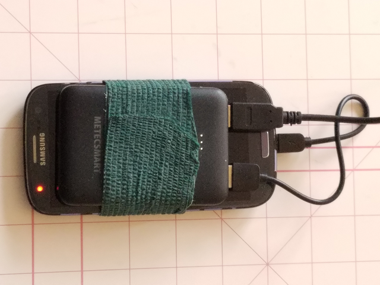

[*[ back to overview ]*](README.md)
[*[ completed ]*](#completed)
[*[ learning ]*](#learning-about-this)
[_[ **Step One: The Accelerometer** ]_](#the-accelerometer)
[*[ Step Two: Solve for Power ]*](#solve-for-power)
[*[ Step Three: Enabling BLE ]*](activity.md/#enabling-ble)

## Implementation

##### Completed:

_skip to
[\[Sept\]](#2021-sept)
[\[Oct\]](#2021-oct)
2021_

##### _2021 Sept_ 

1. **Git** Practicing with Repositories, Branches, Commits, Pull Requests, and Merges with [help from this Guide](https://guides.github.com/activities/hello-world/)
2. **Markdown** Learned to use [Markdown from this guide](https://guides.github.com/features/mastering-markdown/)
3. **TinyML** Took course for TinyML from EdX ([complete](https://credentials.edx.org/credentials/4601700d748c4de0b3a57315ff04831c/))
4. **activity.md** Describes my next steps, ideas, and this Completed list (now is a [to-do list](activity.md))
5. **golf-swing-idea.md** Defines the parts of my golf swing idea (now incorporated into README and deleted)
6. **GitHub Pages** Added using [this guide](https://guides.github.com/features/pages/) and is accessible _here_ (ongoing)
7. Changed _hello-world_ (this) repository to PRIVATE, so it now isn't publicly available on GitHub Pages either (Now renamed to _golf-swing-sensors_ and **is** public. GHPages not enabled.)
8. Installed **GitHub Desktop**, and added [_ArduinoBLE-to-Android_](https://github.com/jeffreysorgen/ArduinoBLE-to-Android) repository (now may not be needed)
9. Defined Golf Swing Data Flow, [_below_](#flow-for-golf-swing-sensors)
10. Created _new-readme.md_ (now [README](README.md)), added implementation.md (this) and made [activity.md](activity.md) into a TO-DO list. (Now deleted the old readme-old.md.)
11. Renamed (this) repository: _hello-world_ is now _golf-swing-sensors_, and updated [README.md](readme.md)
12. [Implementation Part One:](#the-accelerometer) **Set up Accelerometer**

##### _2021 Oct_

13. Determined that the Magnetometer is _not_ going to be used for Ready/Resting orientation. _Gained understanding._ Learned that Accelerometer is going to be used, and magnetometer is unnecessary for the project.
14. Determined that it is _better_ to use `millis()` rather than `delay()` in some cases.
15. Figured out how to set up Ready/Resting states in Arduino Sketch, and display in Monitor.
16. LEARNED that it's easy to mess up in GitHub desktop, so _be careful_
17. **Electronics** Learned cursory principles of electronics from __LinkedIn Learning__.
18. **3D Printing** Learned Basics of 3D Printing from __LinkedIn Learning__.
19. **Arduino sketch** created for Accelerometer - _golf-swing-acc_ ([here](#updating-the-arduino-nano-33-ble)) and kept it **simple**. 
20. **GitHub Markdown** Learned styling for tables, images and code block
21. Added code block and image from Monitor to this documentation. 
22. **Accelerometer** Completed documentation, and it's time to move on to [**adding BLE**](activity.md/#enabling-ble) to the system!
23. **Add BLE** Successfully [copied the process](activity.md/#try-the-ble-example-sketch) of a YouTuber to add BLE services on the device.
24. **Power** Documented several potential development and prototyping [**battery solutions**](#solve-for-power)
25. Generated [pseudo code](activity.md#state-change-pseudo-code) for state changes
26. **New Code** Created _golf-swing-imu-ble_ which communicates via BLE to a smartphone
27. **Editing** Consolidating the documentation in preparation for moving to **Step Four: [the SDK!](activity.md#step-four)**
28. **Posted to Reddit!** [HERE](https://www.reddit.com/r/arduino/comments/qja9y6/nano33blesense_project_first_step_solve_for_power/)

##### Learning about this:
- **nRF Connect**, IMU sensors, BLE, C++, data collection
- GitHub Desktop, possibly GitBASH, KiCad, LTspice, OSHPARK
- Arduino Components and code requirements

## Flow for Golf Swing sensors:

- **BLE** is enabled when the device is powered, waits for pairing forever.
- Pairs with phone app.
- Clear device buffer and **begin loop**
- Enable mag/acc/gyro
- Mag/acc/gyro wait for stillness (no movement)
- Acc then identifies direction of gravity=down.
- Acc/gyro records movement. 
- **Collection mode:** After movement, enables microphone.
  - **Microphone** listens for 3 seconds, and records Null, unless it hears "yes" (**This is KWS**)
  - Send data points to phone app with label. (_Is collection and inference possible together?_)
- _**Inference mode:** Checks data points with **MODEL**_
  - _Beep/buzz if good swing_
  - _Silent (or low tone) if no match_

#
##### Step One:
## The Accelerometer

#### Description: 
**The goal is to "turn on" readings when sensor is oriented with clubhead down at the ground.**
What instrument determines when to begin doing something? 
**The accelerometer**. 
Depending on how the device is attached, one axis determines the direction of gravity. 
That axis has an approximate reading of 1G, the force of gravity in one direction.
Resting state is the negative value of its Ready state.
Some combination of coordinates might need to be calculated with advanced math for _gravity=zero._
But at this stage of development it probably isn't necessary.

#### Why the Accelerometer?
I need one reading - _knowing the orientation of the device._ 
Since the Accelerometer +/- Z axis is up/down, then this is the sensor to use. 
Depending on how the device is attached, it's one of the three axes. 
It's mounted flat and perpendicular to the stick, so the axis changes to the Y-axis.
The axis is "opposite" when the club handle is pointing down and in Resting state. 
When the handle is upright, the club is in play and the sensor is in Ready state.

#### For energy conservation: 
First, understand the orientation of the device.
When the sensor identifies its orientation is as if the club has been put back in the golf bag, then the device just uses one accelerometer parameter, `y < -.85`, meaning Resting state, and then continues to check every second for a change in state. 
BLE will remain engaged.
The connected smartphone device will **beep** only when it identifies a _state change_.
This _beep_ at this point is just for development purposes, but is intended for future use elsewhere.

### Setting up the device:
These readings will determine the Ready or Resting state orientation
- For ease of use, put the Arduino into a breadboard and then attach it to a stick in a perpendicular fashion as shown here. 
- _Imagine your golf club is either being used, or is put back in the golf bag._

##### Images: (1)Attach the device to a stick (2)Ready orientation (3)Device orientation (4)Resting orientation
(1)
(2)
(3)
(4)

#### The readings of the accelerometer, according to the setup in the images:
There is a difference between the Ready(2) position and the Resting(4) orientation. When the device is attached as shown(1), one parameter, the Y-axis (in red) of the Accelerometer, tells the system whether it's in Ready state or it's in Resting state. When the Y-axis reading is positive then the sensor is in one state, and when it's negative it's in the other. Attached this way, the graph(3) shows that the Ready state is positive and the Resting state is negative.

#### Notes about Resting state
The Resting state is meant for when the club is in the bag. If it's in the bag then it's not going to take readings. That would be wasteful. So it's meant to pause all the readings before any more readings are taken. The sensor will stay in Resting state until it senses Ready state. Once in Ready state, the other sensors are turned back on again.

#### What happens: 
1. powered on
2. in the bag, so Resting state
3. pulled out of the bag, senses Ready state
4. at this point, **waits to settle** so it can begin recording motion [(in the next (gyro) section)](activity.md#collect-gyro-data)

#### As shown in the serial monitor:
- The Resting state:
  - the y-axis reading is near -1G (_-0.85_) and displays "One second delay..." 
  - then checks every 1 second using `delay(1000)`
- When `y > -.85`, then the Monitor shows "Ready!" 
  - and displays all the sensor readings (currently just acc)


## Updating the Arduino Nano 33 BLE
- **Find** _SimpleAccelerometer_ from the Example files in the **Arduino_LSM9DS1 folder**
- IMPORTANT: **Save it as** _golf-swing-acc_
- **Add the _if-else_ statements within the _void() loop_ as shown.** (the rest is unchanged) 
  - The _if/else_ statement creates the _-0.85_ threshold between the Ready and Resting states.

#### Code for the new _LOOP_ is here:
```
void loop() {
  float x, y, z;

  if (IMU.accelerationAvailable()) {
    IMU.readAcceleration(x, y, z);
    if ( y > -.85 ) {  // -1G is the threshold
      Serial.print("Ready!");
      Serial.print('\t');
      Serial.print("X = ");
      Serial.print(x);
      Serial.print('\t');
      Serial.print("Y = ");
      Serial.print(y);
      Serial.print('\t');
      Serial.print("Z = ");
      Serial.println(z);
      }
    else { 
      Serial.print("One second delay...");
      Serial.print('\t');
      Serial.print("Y = ");
      Serial.println(y);
      delay(1000); // one second delay
      }
    }
  }
```


## Conclusion:
This section was about setting up the Accelerometer, physically and with the IDE, so that it performs as expected.
The goal was to basically create on/off states, accomplished here by using a threshold for the Ready and Resting states. 

### Possible exception to this configuration
Swinging the club around won't put it into that Resting state unless it registers that particular state of inertia below _-0.85_. While there may be a risk of hitting that threshold while the club is in play, some cursory testing shows that it's possible the risk is low and `(y<-0.85)` doesn't happen or it doesn't hit the delay for some reason.

#
##### Step Two:
## Solve for Power
### Future prototyping solution
- Later can build an obviously better solution.  
- When 100% finished developing with my Arduino Nano 33 BLE Sense, I will be looking into using a different board for prototyping, and a battery solution will definitely be a part of the research.
  - **The board needs to include (1) an IMU, (2) a microphone, and (3) a solvable battery option**
- Battery options:
  - I am looking for those **2-prong** "magnetic" battery chargers, what kind of battery is in that fit-watch, and where to get that rechargable battery. 
  - **Qi coil** is a wireless charging device.
  - **CR1220** is a small, common coin-type battery
  - **LIR2032H** is a common 3.7 rechargable, but 20mm, so like a nickel size.

### Current development solution
- **Connect with only BLE and be _physically detached_ from the computer.**
- Attach the Arduino Sense (USBmicro port) to a power source.
- Use a lightweight **phone recharger** (with 2 USB out) to serve this purpose during development.  
- Rechargers will shut off after a short time with just a low power drain.
- **Charging an _old phone_ at the same time will prevent this auto-shutoff** 

##### Charging up a dead old phone, simultaneously powering Nano33BLE



### Alternative development solution
- This is not practical for _golf-club-sensors_ project but is helpful information nonetheless.
- There's a power solution in the TinyML Course, attaching a 9V battery to the **Learning Kit Shield**. 
  - This [**Appendix**](https://github.com/tinyMLx/appendix/blob/main/PoweringArduino.md#battery) is a good place to read about it.
  - It's certainly not designed for swinging around, but it is proof that there's a pinout solution.
  - It's a good example for a stationary device.

#
[*[ <-- back to README ]*](README.md)
[*[ Step One ]*](#step-one)
[*[ Step Two ]*](#step-two)
**Next: [*[ Step Three: Enabling BLE --> ]*](activity.md/#step-three)**
